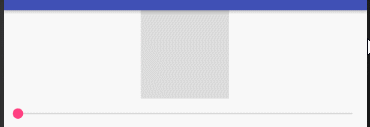
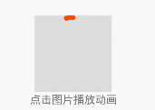
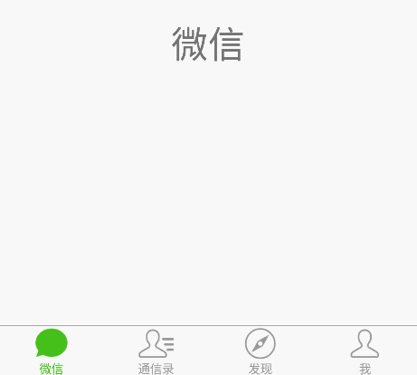
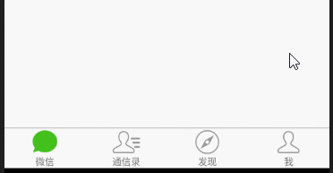

## 该库用于实现动画效果的 Drawable

## 引入

To get a Git project into your build:

**Step 1.** Add the JitPack repository to your build file

Add it in your root build.gradle at the end of repositories:

```
	allprojects {
		repositories {
			...
			maven { url 'https://jitpack.io' }
		}
	}
```

**Step 2.** Add the dependency

```
	dependencies {
	        implementation 'com.github.threekilogram:animateDrawable:1.2.7'
	}
```


## BiliBiliLoadingDrawable

> 仿Bilibili 加载

* 创建

```
BiliBiliLoadingDrawable biliBiliLoadingDrawable = new BiliBiliLoadingDrawable( 200 );
biliBiliLoadingDrawable.setRadius( 20 );
biliBiliLoadingDrawable.setStrokeWidth( 10 );
biliBiliLoadingDrawable.setColor( color );
```

* 设置给view

```
mBilibiliImage.setImageDrawable( biliBiliLoadingDrawable );
```

* 更新进度

```
biliBiliLoadingDrawable.setDrawProgress( v );
```




## CircleLoadingDrawable

> 一个圆圈加载器

* 创建

```
CircleLoadingDrawable circleLoadingDrawable = new CircleLoadingDrawable( 160 );
circleLoadingDrawable.setColor( color );
circleLoadingDrawable.setStrokeWidth( 16 );
```

* 设置给view

```
mCircleImage.setImageDrawable( circleLoadingDrawable );
```

* 更新进度

```
circleLoadingDrawable.setDrawProgress( v );
```




## RoundRectPathDrawable

> 圆角矩形倒计时

* 创建

```
RoundRectCornerDrawable cornerDrawable = new RoundRectCornerDrawable();
cornerDrawable.setColor( color );
```

* 设置给view

```
mCornerImage.setImageDrawable( cornerDrawable );
```

* 更新进度

```
cornerDrawable.setDrawProgress( v );
```


## RoundRectCornerDrawable

> 圆角矩形变换

* 创建

```
RoundRectPathDrawable pathDrawable = new RoundRectPathDrawable();
pathDrawable.setStrokeWidth( 16 );
pathDrawable.setColor( color );
```

* 设置给view

```
mPathImage.setImageDrawable( pathDrawable );
```

* 更新进度

```
pathDrawable.setDrawProgress( v );
```




## AnimateWrapperDrawable

> 包装BaseProgressDrawable使其可以有动画效果

* 创建

```
BiliBiliLoadingDrawable biliLoadingDrawable = new BiliBiliLoadingDrawable( 200 );
biliLoadingDrawable.setRadius( 20 );
biliLoadingDrawable.setStrokeWidth( 10 );
biliLoadingDrawable.setColor( color );
AnimateWrapperDrawable bilibiliWrapper = new AnimateWrapperDrawable(biliLoadingDrawable );
bilibiliWrapper.setDuration( 4000 );
```

* 设置给view

```
mBilibiliAnimateImage.setImageDrawable( bilibiliWrapper );
```

* 启动

```
bilibiliWrapper.start();
```

* 结束

```
bilibiliWrapper.stop();
```

## AnimateDrawableView

> 包装BaseProgressDrawable使其可以有动画效果

* 创建

```
mBilibiliView = findViewById( R.id.bilibiliView );
BiliBiliLoadingDrawable loadingDrawable = new BiliBiliLoadingDrawable();
mBilibiliView.setDrawable( loadingDrawable );
```

* 开始

```
mBilibiliView.start();
```

* 结束

```
mBilibiliView.stop();
```


## 微信底部导航效果

* 创建

```
Bitmap bitmapNormal = BitmapFactory.decodeResource(
    getResources(),
    R.drawable.mine_normal
);
Bitmap bitmapSelected = BitmapFactory.decodeResource(
    getResources(),
    R.drawable.mine_selected
);
AlphaProgressDrawable drawable = new AlphaProgressDrawable(
    bitmapNormal,
    bitmapSelected
);
```

```
int colorNormal = getResources().getColor( R.color.textColorNormal );
int colorSelect = getResources().getColor( R.color.textColorSelected );
ProgressColorTextView textView = new ProgressColorTextView(WeChatBottomActivity.this );
textView.setTextColor( colorNormal, colorSelect );
```

```
mDrawables.setProgress( progress );
mTextViews.setTextColorProgress( progress );
```

