## 有动画效果的 Drawable

```
implementation 'tech.liujin:animateDrawable:1.0.7'
```

## 简介

`ProgressDrawable` 用于根据进度值绘制一个drawable

`AnimateWrapperDrawable`用于包装`ProgressDrawable` 为其增加动画效果

## 使用

```
BiliBiliDrawable biliBiliDrawable = new BiliBiliDrawable();
biliBiliDrawable.setColor( color );

// 设置绘制进度,0~1
biliBiliDrawable.setDrawProgress( process );
```

使用动画

```
AnimateProgressDrawable wrapperDrawable = new AnimateProgressDrawable( biliBiliDrawable );
wrapperDrawable.setCount( count ); //设置循环次数
wrapperDrawable.setDuration( duration ); //设置动画时间
wrapperDrawable.setInterpolator( interpolator ); 

// 开始动画
wrapperDrawable.start();
// 结束动画
wrapperDrawable.stop();
// 测试是否正在运行
wrapperDrawable.isRunning()
```

### BiliBiliDrawable


### CirclePathDrawable


### RoundRectPathDrawable


### RoundRectCornerDrawable


### BallPulseDrawable

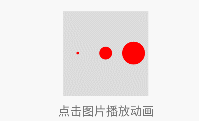


### BallGridPulseDrawable

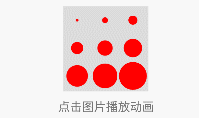


### CubeFlipDrawable


### BallRotateDrawable


### CubeTwoRotateDrawable


### BallTriangleRotateDrawable


### StrokeWaveDrawable


### StrokePulseDrawable


### BallCircleScaleDrawable


### PacManDrawable


### StrokePulsePushDrawable


### BallTwoRotateDrawable

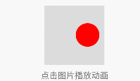


### BallPulsePushDrawable


### CubeGridDrawable


### BallCircleAlphaDrawable


### StrokeSkipDrawable


### ArcProgressDrawable


### ArcChangeRotateDrawable


### WrongRightDrawable


### AddLoadDoneDrawable

一个拥有三个状态的Drawable


### TextLoadDoneDrawable


### CircleTextProgressDrawable

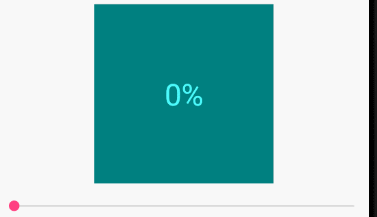


### CircleInRingProgressDrawable

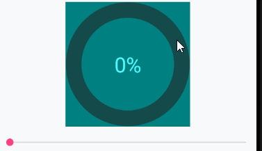


### CircleDotProgressDrawable


### CircleMatchRingProgressDrawable

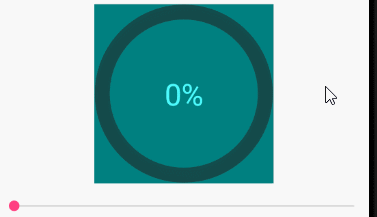


### PieTextProgressDrawable

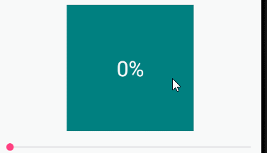


### PieMatchCircleProgressDrawable

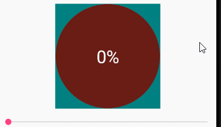


### PieOutCircleProgressDrawable

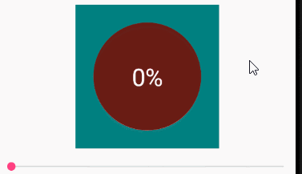


### PieInRingProgressDrawable

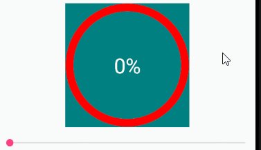


### FillCircleProgressDrawable

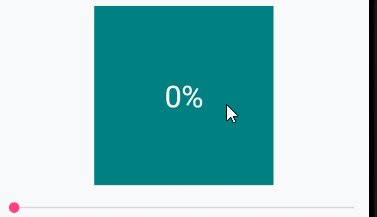


### FillMatchCircleProgressDrawable

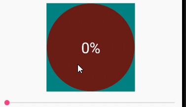


### FillOutCircleProgressDrawable

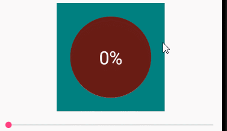


### FillInRingProgressDrawable

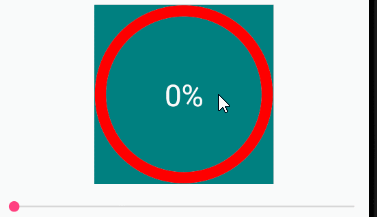


### ColorEvaluator

根据进度值计算一组颜色的当前值

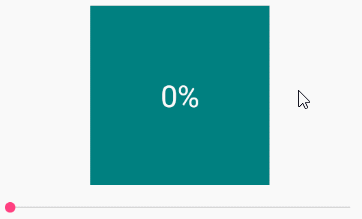

```
ColorEvaluator evaluator = new ColorEvaluator(
    getResourceColor( R.color.red ),
    getResourceColor( R.color.orange ),
    getResourceColor( R.color.yellow ),
    getResourceColor( R.color.chartreuse ),
    getResourceColor( R.color.green ),
    getResourceColor( R.color.blue ),
    getResourceColor( R.color.purple )
);
FillCircleProgressDrawable drawable = new FillCircleProgressDrawable();
mColorEvaluator.setImageDrawable( drawable );
mColorEvaluatorSeek.setOnSeekBarChangeListener( new SimpleOnSeekBarChangeListener() {

      @Override
      public void onProgressChanged ( SeekBar seekBar, int progress, boolean fromUser ) {

            float v = progress * 1f / seekBar.getMax();
            // 计算颜色
            int color = evaluator.evaluate( v );
            // 应用该颜色
            drawable.setColor( color );
            drawable.setDrawProgress( v );
      }
} );
```


### HaloTextProgressDrawable

光晕效果

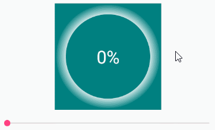


### ClockDrawable

时钟样式的倒计时

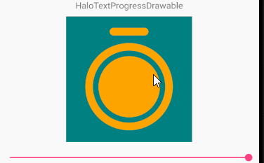


### HourglassDrawable

沙漏样式的倒计时


### 仿微信底部导航

```
mPager = findViewById( R.id.pager );
mTabLayout = findViewById( R.id.tabLayout );
PagerAdapter adapter = new PagerAdapter( getSupportFragmentManager() );
mPager.setAdapter( adapter );
// 辅助关联ViewPager和TabLayout
TabItemBuilder builder = new ItemBuilder( mTabLayout, mPager );
builder.setTitles( mTitles );
// 设置textView文字颜色变化
builder.setTextColorRes( R.color.textColorNormal, R.color.textColorSelected );
// 配置每个图标资源
builder.setDrawable( 0, R.drawable.home_normal, R.drawable.home_selected );
builder.setDrawable( 1, R.drawable.category_normal, R.drawable.category_selected );
builder.setDrawable( 2, R.drawable.find_normal, R.drawable.find_selected );
builder.setDrawable( 3, R.drawable.mine_normal, R.drawable.mine_selected );
// 创建
builder.build( 0 );
```


